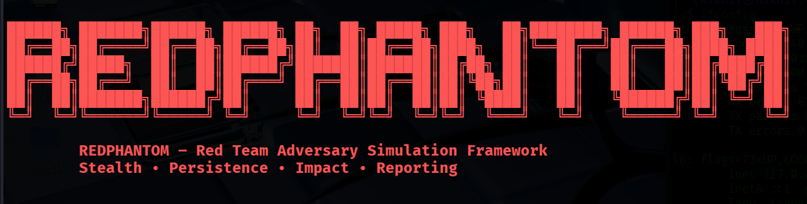

# RedPhantom-RTF

<div align="center">



**A Modular Red Team Simulation Framework for Ethical Security Assessments**

[](https://www.python.org/downloads/)
[](LICENSE)
[]()
[]()

[Features](#features) • [Installation](#installation) • [Usage](#usage) • [Troubleshooting](#troubleshooting) • [Contributing](#contributing)

</div>

---

## ⚠️ CRITICAL LEGAL & ETHICAL NOTICE

**READ THIS BEFORE USING REDPHANTOM**

RedPhantom-RTF is a professional security assessment framework designed **EXCLUSIVELY** for authorized, ethical security testing. By using this tool, you acknowledge and agree to:

### Legal Requirements
- ✅ **WRITTEN AUTHORIZATION REQUIRED**: You must have explicit, written permission from the system owner before any scanning or testing
- ⚖️ **Legal Compliance**: Unauthorized use may violate laws including Computer Fraud and Abuse Act (CFAA), Computer Misuse Act, GDPR, and similar cybercrime laws
- 🚫 **Penalties**: Unauthorized access can result in criminal charges, fines, and imprisonment

### Ethical Guidelines
- 🎯 Only test systems you own or have explicit permission to test
- 📝 Document all testing activities and maintain engagement records
- 🔒 Protect all discovered vulnerabilities and handle data responsibly
- 👥 Respect privacy and confidentiality of all parties involved
- 🛡️ Follow responsible disclosure practices for any findings

### Liability Disclaimer
**THE DEVELOPERS AND CONTRIBUTORS OF REDPHANTOM-RTF ASSUME NO LIABILITY FOR MISUSE, UNAUTHORIZED ACCESS, DATA LOSS, LEGAL CONSEQUENCES, OR ANY VIOLATIONS OF APPLICABLE LAWS.**

**USE AT YOUR OWN RISK. YOU ARE SOLELY RESPONSIBLE FOR YOUR ACTIONS.**

---

## 📋 Table of Contents

- [About](#about-redphantom-rtf)
- [Features](#features)
- [Architecture](#architecture)
- [Installation](#installation)
- [Configuration](#configuration)
- [Usage Guide](#usage-guide)
- [Troubleshooting](#troubleshooting)
- [Security Best Practices](#security-best-practices)
- [Development Roadmap](#development-roadmap)
- [Contributing](#contributing)
- [FAQ](#faq)
- [License](#license)

---

## 🎯 About RedPhantom-RTF

RedPhantom-RTF (Red Team Framework) is an advanced, AI-powered security assessment platform built for comprehensive red team operations combining traditional penetration testing with modern AI capabilities.

### What Makes RedPhantom Unique?

- 🤖 **AI-Enhanced Analysis**: Multi-provider AI integration (OpenAI, Google Gemini)
- 🔍 **Comprehensive Reconnaissance**: Advanced OSINT, subdomain enumeration
- 📊 **Professional Reporting**: HTML reports with executive summaries
- 🛡️ **Safety-First Design**: Non-exploitative scanning
- 🎨 **Modular Architecture**: Extensible framework
- 📈 **MITRE ATT&CK Mapping**: Industry-standard alignment
- ⚡ **Automation-Ready**: CI/CD integration support

### Use Cases

- Red Team Engagements | Penetration Testing | Security Posture Assessments | Vulnerability Management | Compliance Auditing | Security Research | Bug Bounty Programs

---

## ✨ Features

### Reconnaissance & Intelligence ✅

- Domain & Subdomain Enumeration
- Multi-threaded Port Scanning
- Service Version Detection
- DNS Analysis & Zone Transfer Testing
- WHOIS Intelligence
- SSL/TLS Certificate Analysis

### Analysis & Assessment ✅

- CVE Mapping & Vulnerability Scanning
- Security Misconfiguration Detection
- CVSS-inspired Risk Scoring
- Passive Credential Intelligence
- Web Application Security Analysis

### AI Integration ✅

- OpenAI GPT-4 & Google Gemini Support
- Natural Language Executive Summaries
- AI-Powered Threat Intelligence
- Automated Remediation Guidance
- Intelligent Provider Fallback

### Reporting ✅

- Professional HTML Reports
- Executive & Technical Summaries
- MITRE ATT&CK Mapping
- Prioritized Remediation Roadmaps
- JSON Export (In Progress)

### Safety Features ✅

- Read-Only Operations
- Authorization Validation
- Complete Audit Logging
- Network-Friendly Rate Limiting

---

## 🏗️ Architecture

RedPhantom-RTF follows a modular, plugin-based architecture:

```
┌─────────────────────────────────────────┐
│       RedPhantom-RTF Core              │
│  ┌──────────┐  ┌──────────┐           │
│  │   CLI    │  │ Web/API  │           │
│  └────┬─────┘  └────┬─────┘           │
│       │             │                  │
│  ┌────▼─────────────▼──────┐          │
│  │  Workflow Engine         │          │
│  └────┬─────────────────────┘          │
│       │                                 │
│  ┌────▼─────────────────────┐          │
│  │  Module Management       │          │
│  └┬────┬────────┬──────────┘          │
│   │    │        │                      │
│ ┌▼─┐┌▼──┐  ┌▼────┐                   │
│ │Recon││Analysis││Report│             │
│ └───┘└────┘  └─────┘                  │
│       │                                 │
│  ┌────▼──────────────────┐            │
│  │  Data & AI Layer      │            │
│  │  (OpenAI, Gemini)     │            │
│  └───────────────────────┘            │
└─────────────────────────────────────────┘
```

**Components**: Scanner Engine | AI Wrapper | Report Generator | Module Manager | Data Pipeline | Logging System

---

## 💻 Installation

### Prerequisites

- **OS**: Linux (Ubuntu 20.04+, Kali, Parrot), macOS 11+, Windows 10/11 + WSL2
- **Python**: 3.8+ (3.10+ recommended)
- **RAM**: 4GB minimum (8GB+ recommended)
- **Disk**: 2GB free space
- **Network**: Internet for AI features

### Quick Installation

```bash
# Clone repository
git clone https://github.com/nikhilkumar0102/RedPhantom-RTF-.git
cd RedPhantom-RTF-

# Create virtual environment
python3 -m venv venv
source venv/bin/activate  # Windows: venv\Scripts\activate

# Install dependencies
pip install --upgrade pip
pip install -r requirements.txt

# Verify installation
python RedPhantom/main.py --version
```

### Optional Dependencies

```bash
# Ubuntu/Debian
sudo apt-get install nmap nikto

# macOS
brew install nmap
```

### Docker Installation

```bash
docker build -t redphantom-rtf .
docker run -it --rm -v $(pwd)/reports:/app/reports -e OPENAI_API_KEY=your_key redphantom-rtf --target example.com
```

---

## 🐛 Troubleshooting

### Common Issues

**Import Errors**
```bash
source venv/bin/activate
pip install -r requirements.txt
pip cache purge && pip install --no-cache-dir -r requirements.txt
```

**Permission Denied**
```bash
sudo python RedPhantom/main.py --target example.com
# OR
sudo setcap cap_net_raw,cap_net_admin,cap_net_bind_service+eip /usr/bin/nmap
```

**API Rate Limits**
```bash
python RedPhantom/main.py --target example.com --rate-limit 10
python RedPhantom/main.py --target example.com --no-ai
```

**DNS Resolution Failures**
```bash
ping 8.8.8.8
python RedPhantom/main.py --target example.com --dns-servers 8.8.8.8,1.1.1.1
```

**Memory Issues**
```bash
python RedPhantom/main.py --target example.com --threads 5 --max-subdomains 100
```

### Debug Mode

```bash
python RedPhantom/main.py --target example.com --debug --log-file debug.log
tail -f logs/redphantom.log
```

### Platform-Specific

**Windows WSL2:**
```bash
wsl --update
sudo apt update && sudo apt upgrade
sudo apt install python3-pip python3-venv
```

**macOS ARM (M1/M2):**
```bash
arch -x86_64 pip install -r requirements.txt
# OR
pip install --upgrade pip && pip install -r requirements.txt --no-cache-dir
```

---

## ⚙️ Configuration

### Environment Variables (.env)

```bash
# API Keys
OPENAI_API_KEY=sk-your-key
GEMINI_API_KEY=your-key

# Options
SCAN_THREADS=10
TIMEOUT=30
RATE_LIMIT=100
OUTPUT_DIR=./reports
LOG_LEVEL=INFO
ENABLE_AI=true
DEFAULT_AI_PROVIDER=openai

# Proxy (Optional)
HTTP_PROXY=http://proxy:8080
HTTPS_PROXY=http://proxy:8080

# Advanced
MAX_SUBDOMAINS=500
PORT_RANGE=1-65535
MITRE_MAPPING=true
```

### Configuration File (config.yaml)

```yaml
general:
  output_dir: ./reports
  log_level: INFO
  scan_threads: 10

ai:
  enabled: true
  default_provider: openai

scanning:
  rate_limit: 100
  port_range: 1-65535

reporting:
  format: html
  mitre_mapping: true
```

### API Keys

**OpenAI**: [platform.openai.com](https://platform.openai.com/) → API Keys → Create new secret key

**Gemini**: [makersuite.google.com](https://makersuite.google.com/) → Get API Key

---

## 📖 Usage Guide

### Basic Usage

```bash
# Simple scan
python RedPhantom/main.py --target example.com

# Verbose output
python RedPhantom/main.py --target example.com --verbose

# Multiple targets
python RedPhantom/main.py --targets target1.com target2.com target3.com

# From file
python RedPhantom/main.py --target-file targets.txt
```

### Advanced Operations

```bash
# Specific modules
python RedPhantom/main.py --target example.com --modules recon
python RedPhantom/main.py --target example.com --modules port_scan,service_detection

# Custom configuration
python RedPhantom/main.py --target example.com --config custom-config.yaml --threads 20

# Stealth/Aggressive modes
python RedPhantom/main.py --target example.com --stealth
python RedPhantom/main.py --target example.com --aggressive

# Custom port range
python RedPhantom/main.py --target example.com --ports 80,443,8080-8090
```

### AI Integration

```bash
# Enable AI
python RedPhantom/main.py --target example.com --ai

# Specify provider
python RedPhantom/main.py --target example.com --ai-provider openai

# Disable AI
python RedPhantom/main.py --target example.com --no-ai
```

### Report Generation

```bash
# HTML report
python RedPhantom/main.py --target example.com --output-format html

# JSON report
python RedPhantom/main.py --target example.com --output-format json

# Both formats
python RedPhantom/main.py --target example.com --output-format html,json
```

### Example Workflows

**Comprehensive Assessment:**
```bash
TARGET="example.com"
OUTPUT="./reports/$(date +%Y%m%d)-${TARGET}"
python RedPhantom/main.py --target $TARGET --modules all --ai --output $OUTPUT --verbose --output-format html,json
```

**Quick Reconnaissance:**
```bash
python RedPhantom/main.py --target example.com --modules recon,port_scan --threads 50 --no-ai
```

---

## 🛡️ Security Best Practices

### Before Assessment

1. ✅ **Obtain Written Authorization** - Get explicit, signed permission
2. 📝 **Document Everything** - Maintain detailed logs
3. 🔒 **Secure Your Environment** - Use VPN, secure credentials

### During Assessment

1. ⚠️ **Monitor Impact** - Watch system performance
2. 📊 **Stay Within Scope** - Only test authorized systems
3. 🔐 **Protect Discovered Data** - Encrypt sensitive findings

### After Assessment

1. 📄 **Responsible Disclosure** - Report findings promptly
2. 🗑️ **Secure Cleanup** - Delete temporary files
3. 📈 **Continuous Improvement** - Review lessons learned

### Data Protection

```bash
# Encrypt reports
gpg --encrypt --recipient security@example.com report.html

# Secure delete
shred -vfz -n 10 temp-data.txt

# Secure API keys
export OPENAI_API_KEY=$(pass show openai/api-key)
```

---

## 🚀 Development Roadmap

### Phase 1: Core Stability (Q1 2026) ⏳

- [x] Basic reconnaissance modules
- [x] Port scanning & service detection
- [x] AI integration (OpenAI, Gemini)
- [x] HTML report generation
- [ ] Comprehensive test coverage (70%)
- [ ] Performance optimizations

### Phase 2: Enhanced Capabilities (Q2 2026) 📋

- [ ] Advanced web application scanning
- [ ] API security testing
- [ ] Cloud security assessment (AWS, Azure, GCP)
- [ ] Container & Kubernetes scanning
- [ ] PDF export
- [ ] Plugin marketplace

### Phase 3: Enterprise Features (Q3 2026) 💭

- [ ] Multi-user support & RBAC
- [ ] Centralized management dashboard
- [ ] SIEM integration
- [ ] Compliance frameworks (PCI-DSS, HIPAA, ISO 27001)
- [ ] Automated remediation workflows
- [ ] ML threat prediction

### Known Limitations

1. **Credential Intelligence** ⚠️ - Limited to passive lookups
2. **Screenshots** ⚠️ - Basic functionality
3. **Report Formats** ⚠️ - HTML/JSON only (no PDF yet)
4. **Performance** ⚠️ - Large-scale scans can be slow
5. **Mobile Support** ⚠️ - No mobile device testing yet

---

## 🤝 Contributing

We welcome contributions! Here's how:

### How to Contribute

```bash
# Fork and clone
git clone https://github.com/YOUR_USERNAME/RedPhantom-RTF-.git
cd RedPhantom-RTF-
git remote add upstream https://github.com/nikhilkumar0102/RedPhantom-RTF-.git

# Create branch
git checkout -b feature/your-feature-name

# Make changes, test
flake8 RedPhantom/
pytest tests/

# Commit and push
git add .
git commit -m "Add feature: description"
git push origin feature/your-feature-name

# Create Pull Request on GitHub
```

### Contribution Guidelines

- Follow PEP 8 style guide
- Write unit tests for new features
- Update documentation
- No hardcoded credentials
- Validate all user inputs

### Areas Needing Contribution

🔴 **High Priority**: Bug fixes, performance, tests, docs
🟡 **Medium Priority**: New modules, reporting, AI integrations
🟢 **Nice to Have**: Refactoring, i18n, tutorials

---

## ❓ FAQ

**Q: Is RedPhantom-RTF free?**  
A: Yes, open-source and free under MIT License.

**Q: Do I need API keys?**  
A: Optional. Tool works without them, but AI features require OpenAI/Gemini keys.

**Q: Is this legal?**  
A: Yes, when used ethically with proper authorization. Unauthorized use is illegal.

**Q: Can I use for bug bounties?**  
A: Yes, following program rules.

**Q: Windows support?**  
A: Yes, via WSL2 (Linux recommended).

**Q: How to add custom modules?**  
A: Create module in `RedPhantom/modules/` following existing structure.

**Q: IPv6 support?**  
A: Yes, both IPv4 and IPv6.

**Q: Multiple concurrent scans?**  
A: Yes, use separate output directories.

**Q: Which AI provider?**  
A: OpenAI GPT-4 for comprehensive analysis, Gemini for cost-effectiveness.

**Q: AI costs?**  
A: Typical assessment: $0.50-$2.00 in API fees.

**Q: Slow scans?**  
A: Adjust `--threads`, check network, or use `--stealth`.

**Q: SSL errors?**  
A: Update certificates: `pip install --upgrade certifi`

**Q: Reports not generating?**  
A: Check permissions, disk space, dependencies.

**Q: Assessment frequency?**  
A: Quarterly recommended, plus after major changes.

---

## 📄 License

Released under **MIT License**.

```
MIT License

Copyright (c) 2026 Nikhil Kumar

Permission is hereby granted, free of charge, to any person obtaining a copy
of this software and associated documentation files (the "Software"), to deal
in the Software without restriction, including without limitation the rights
to use, copy, modify, merge, publish, distribute, sublicense, and/or sell
copies of the Software, and to permit persons to whom the Software is
furnished to do so, subject to the following conditions:

The above copyright notice and this permission notice shall be included in all
copies or substantial portions of the Software.

THE SOFTWARE IS PROVIDED "AS IS", WITHOUT WARRANTY OF ANY KIND, EXPRESS OR
IMPLIED, INCLUDING BUT NOT LIMITED TO THE WARRANTIES OF MERCHANTABILITY,
FITNESS FOR A PARTICULAR PURPOSE AND NONINFRINGEMENT. IN NO EVENT SHALL THE
AUTHORS OR COPYRIGHT HOLDERS BE LIABLE FOR ANY CLAIM, DAMAGES OR OTHER
LIABILITY, WHETHER IN AN ACTION OF CONTRACT, TORT OR OTHERWISE, ARISING FROM,
OUT OF OR IN CONNECTION WITH THE SOFTWARE OR THE USE OR OTHER DEALINGS IN THE
SOFTWARE.
```

---

## 🙏 Acknowledgments

### Special Thanks

- Security Community for feedback and testing
- Open Source Contributors
- OpenAI and Google for AI capabilities
- Beta Testers

### Inspiration

- MITRE ATT&CK Framework
- Penetration Testing Execution Standard (PTES)
- OWASP Testing Guide
- Red Team Field Manual

---

## 📞 Contact & Support

### Get Help

- 📖 **Documentation**: This README + `/docs`
- 🐛 **Bug Reports**: [GitHub Issues](https://github.com/nikhilkumar0102/RedPhantom-RTF-/issues)
- 💬 **Discussions**: [GitHub Discussions](https://github.com/nikhilkumar0102/RedPhantom-RTF-/discussions)

### Stay Updated

- ⭐ Star this repo for notifications
- 👁️ Watch releases for new versions

---

## ⚖️ Legal Disclaimer

**IMPORTANT: READ CAREFULLY**

This tool is for educational and ethical security testing ONLY. By using RedPhantom-RTF:

1. You will only use on systems you own or have explicit written permission to test
2. You accept full responsibility for your actions
3. Developers assume no liability for misuse or damages
4. You will comply with all applicable laws
5. You will not use for illegal activities
6. Unauthorized computer access is a serious crime

**Violation may result in: Criminal prosecution, civil liability, fines, imprisonment, professional sanctions**

**USE AT YOUR OWN RISK. YOU HAVE BEEN WARNED.**

---

<div align="center">

### Built with ❤️ for the Security Community

**RedPhantom-RTF** | Making Red Team Operations Safer and Smarter

[⬆ Back to Top](#redphantom-rtf)

**Version 1.0.0 Beta** | Last Updated: February 2, 2026

</div>
